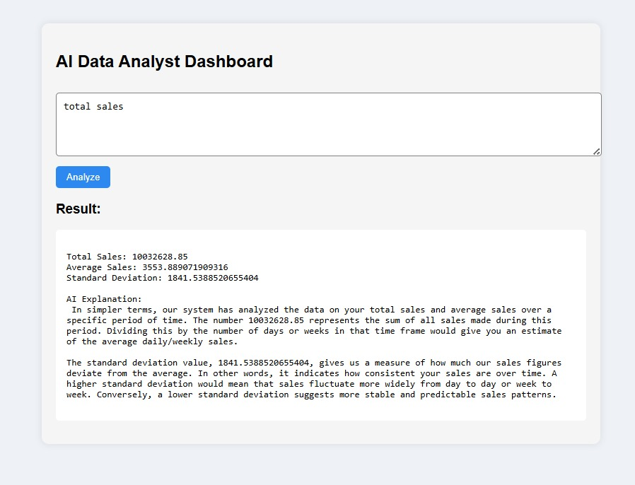

# 🚀 CoreInsights

AI-powered data analytics platform that transforms raw CSV data into actionable insights using natural language analysis and interactive visualizations.

---

## 📌 Project Preview



---

## ✨ Features

- 📂 Upload and analyze CSV datasets
- 🤖 AI-powered natural language querying
- 📊 Interactive charts and visualizations
- ⚡ Real-time data insights generation
- 🧠 LangChain + Ollama integration
- 🌐 Full-stack architecture using React and Flask
- 📈 Intelligent analytics dashboard

---

## 🛠️ Tech Stack

### Frontend
- React.js
- Vite
- JavaScript
- CSS

### Backend
- Flask
- Python
- REST API

### AI & Data Processing
- LangChain
- Ollama
- Pandas
- NumPy
- Matplotlib

---

## 🏗️ Project Architecture

```text
Frontend (React)
        ↓
Flask Backend API
        ↓
LangChain + Ollama
        ↓
Data Analysis Engine
        ↓
Insights & Visualizations
